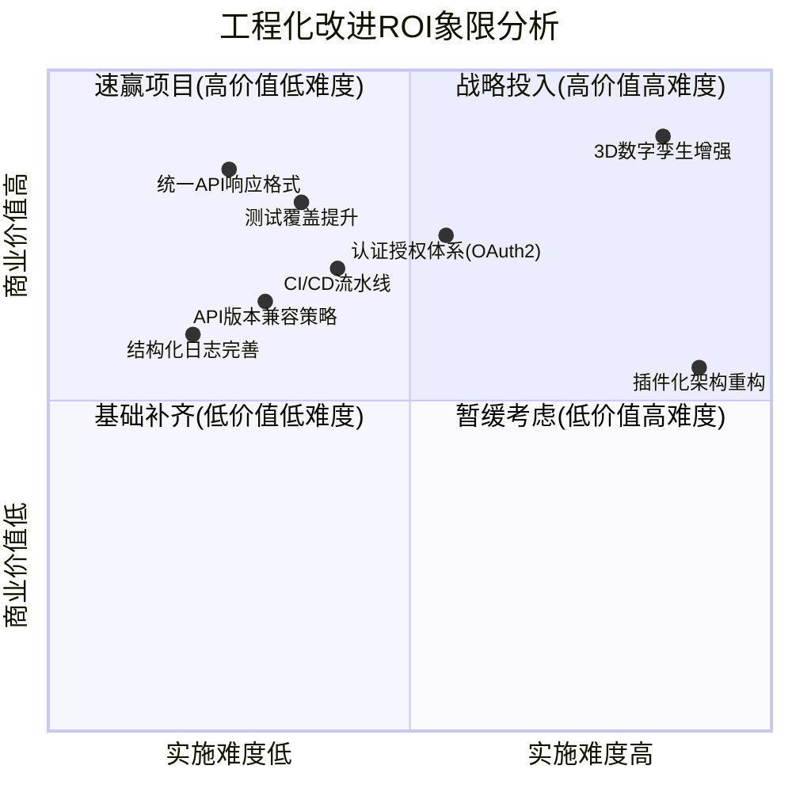

# AgvTms 工程化成熟度对标与API迭代方案

**版本**: v3.0 Engineering Edition  
**日期**: 2026-07-05  
**对标产品**: 海康RCS-2000 V4.x | Plant Mirror 仿真平台  
**基准项目**: AgvTms Phase 5.5 (当前分支: 2.4)  
**核心目标**: 强烈对标本商业产品的工程化、商业成熟度、集成性和API接口设计

---

## 一、竞品工程化深度剖析

### 1.1 海康RCS-2000 商业产品工程化特征

#### 1.1.1 系统架构（从集成开发指南逆向分析）

```
┌─────────────────────────────────────────────────────────────────────┐
│                   海康RCS-2000 商业架构                              │
├─────────────────────────────────────────────────────────────────────┤
│                                                                     │
│  ┌─────────────┐    ┌─────────────┐    ┌─────────────────────────┐  │
│  │   WMS/MES   │    │   ERP/SAP   │    │    第三方业务系统        │  │
│  │   (上层系统) │    │             │    │                         │  │
│  └──────┬──────┘    └──────┬──────┘    └───────────┬─────────────┘  │
│         │                  │                       │                │
│         ▼                  ▼                       ▼                │
│  ┌──────────────────────────────────────────────────────────────┐  │
│  │              AgvService (服务接口层 - Spring Boot)            │  │
│  │  ┌──────────────┐  ┌──────────────┐  ┌────────────────────┐  │  │
│  │  │ /api/agv/task│  │ /api/agv/status│ │ /api/agv/robot     │  │  │
│  │  │ /create      │  │              │  │ /stop,/resume       │  │  │
│  │  └──────────────┘  └──────────────┘  └────────────────────┘  │  │
│  └───────────────────────────┬──────────────────────────────────┘  │
│                              │                                      │
│  ┌───────────────────────────▼──────────────────────────────────┐  │
│  │              RcsService (核心业务逻辑层)                        │  │
│  │  ┌────────────┐  ┌────────────┐  ┌────────────────────────┐  │  │
│  │  │ 任务管理引擎 │  │ 状态缓存层 │  │ 设备控制代理            │  │  │
│  │  │ (创建/继续/  │  │ (Redis TTL │  │ (stopRobot/resumeRobot)│  │  │
│  │  │  取消/重试)  │  │  30s过期)  │  │                        │  │  │
│  │  └────────────┘  └────────────┘  └────────────────────────┘  │  │
│  └───────────────────────────┬──────────────────────────────────┘  │
│                              │                                      │
│  ┌───────────────────────────▼──────────────────────────────────┐  │
│  │           RCS Core System (海康内核 - 黑盒)                    │  │
│  │  ┌──────────┐ ┌──────────┐ ┌──────────┐ ┌──────────────────┐  │  │
│  │  │ 调度核心  │ │地图引擎  │ │交通管制  │ │ 预测调度+负载均衡 │  │  │
│  │  └──────────┘ └──────────┘ └──────────┘ └──────────────────┘  │  │
│  └───────────────────────────────────────────────────────────────┘  │
│                              │                                      │
│  ┌───────────────────────────▼──────────────────────────────────┐  │
│  │                    AGV/AMR 集群                                │  │
│  │         潜伏顶升 | 叉车 | 料箱 | 移动复合机器人               │  │
│  └───────────────────────────────────────────────────────────────┘  │
│                                                                     │
│  基础设施: MySQL + Redis + Spring Retry + SLF4J + Swagger          │
└─────────────────────────────────────────────────────────────────────┘
```

#### 1.1.2 API工程设计规范（商业级特征）

| 特征维度 | 海康RCS实现 | AgvTms现状 | 差距分析 |
|---------|------------|-----------|---------|
| **API风格** | RESTful + 统一响应`Result<T>` | RESTful + 直接返回数据 | 缺少统一响应包装 |
| **错误处理** | `@RestControllerAdvice`全局异常 | FastAPI Exception Handlers | 基本具备 |
| **状态码规范** | 200成功/500失败(简化) | HTTP标准状态码 | 海康更简洁 |
| **重试机制** | 内置Spring Retry + 指数退避 | Kafka DLQ死信队列 | 方式不同 |
| **文档标准** | Swagger/OpenAPI 2.0 | Swagger Auto (FastAPI) | ✅ AgvTms更优 |
| **版本管理** | URL路径版本(/api/v1/) | V1/V2共存 | ✅ 都有 |

#### 1.1.3 核心API端点对比矩阵

```mermaid
graph LR
    subgraph "海康RCS 核心API"
        direction TB
        H1[POST /api/agv/task/create] 
        H2[POST /api/agv/task/continue]
        H3[POST /api/agv/task/cancel]
        H4[GET /api/agv/status]
        H5[POST /api/agv/robot/stop]
        H6[POST /api/agv/robot/resume]
    end
    
    subgraph "AgvTms 对应能力"
        direction TB
        A1[POST /api/tasks] 
        A2[PUT /api/tasks/{id}/resume]
        A3[DELETE /api/tasks/{id}]
        A4[GET /api/agvs]
        A5[POST /api/v2/vehicles/{id}/stop]
        A6[POST /api/v2/vehicles/{id}/resume]
    end
    
    H1 -.->|对应| A1
    H2 -.->|对应| A2
    H3 -.->|对应| A3
    H4 -.->|对应| A4
    H5 -.->|对应| A5
    H6 -.->|对应| A6
```

### 1.2 Plant Mirror 数字孪生平台工程化特征

#### 1.2.1 产品定位与能力矩阵

```
┌─────────────────────────────────────────────────────────────────────┐
│              PlantMirror (磐镜) 3D数字孪生仿真平台                   │
├─────────────────────────────────────────────────────────────────────┤
│                                                                     │
│  核心能力域:                                                         │
│  ══════════                                                          │
│  ┌──────────────────┐  ┌──────────────────┐  ┌──────────────────┐  │
│  │ 🤖 AMR智能装备库  │  │ 🏭 传统装备库     │  │ 🌐 工业生态库     │  │
│  │ - 潜伏顶升机器人   │  │ - 输送线/提升机   │  │ - 机台/货架/工作站│  │
│  │ - 叉车/料箱机器人  │  │ - 电梯/卷帘门     │  │ - 安全围栏/消防  │  │
│  │ - 复合移动机器人   │  │ - 分拣机/打包台   │  │ - 人机工位       │  │
│  └──────────────────┘  └──────────────────┘  └──────────────────┘  │
│                                                                     │
│  三种建模方式:                                                        │
│  ══════════════                                                      │
│  ① 内置模型拖拽 → 所见即得快速搭建                                     │
│  ② AIGC图生3D  → 上传照片自动生成3D模型                               │
│  ③ CAD图纸解析  → 2D→3D自动转换+路网生成                              │
│                                                                     │
│  核心算法指标:                                                        │
│  ════════════                                                        │
│  ✅ 自研路网规划算法 (可行域切割提取)                                   │
│  ✅ 轻量调度算子 (10倍仿真加速, 零压性能消耗)                           │
│  ✅ 动态调度算法 (最大5倍仿真加速, 千台协同)                            │
│  ✅ 业务组配置 + 调度卡编排 (零代码任务设计)                             │
│                                                                     │
│  可视化能力:                                                          │
│  ══════════                                                          │
│  ✅ 3D + 2D 数据看板                                                 │
│  ✅ 手柄漫游交互                                                      │
│  ✅ VR沉浸式查看                                                      │
│  ✅ 实时机台效能/设备利用率监控                                        │
└─────────────────────────────────────────────────────────────────────┘
```

#### 1.2.2 Plant Mirror vs AgvTms 数字孪生能力差距

| 能力维度 | Plant Mirror | AgvTms 当前 | 差距等级 |
|---------|-------------|------------|---------|
| **3D渲染引擎** | WebGL专业级 | WebSocket基础3D (digital_twin_ws.py) | 🔴🔴🔴 代际差 |
| **内置模型库** | 海量AMR/传统装备/工业生态 | 无 | 🔴🔴🔴 从零开始 |
| **AIGC建模** | 图生3D大模型 | 无 | 🔴🔴🔴 需AI能力 |
| **CAD导入** | 2D→3D自动解析 | JSON手动配置 | 🔴🔴 效率差距100x |
| **仿真加速** | 5-10x实时加速 | 实时1:1 | ⚠️ 性能差距 |
| **调度可视化** | 3D连线+调度卡 | 2D AntV L7 | 🔴🔴 维度差异 |
| **多仓统筹** | 支持 | 单实例 | ⚠️ 架构限制 |
| **VR/手柄** | 原生支持 | 不支持 | 🔴🔴 体验差距 |

---

## 二、AgvTms工程化成熟度自评

### 2.1 当前工程化水平评估 (10分制)

| 评估维度 | 权重 | 海康RCS | PlantMirror | AgvTms得分 | 目标得分 |
|---------|------|--------|-------------|-----------|---------|
| **代码质量与规范** | 15% | 9.0 | 8.5 | 7.0 | 8.5 |
| **API设计专业性** | 20% | 8.5 | N/A | 7.5 | 9.0 |
| **测试覆盖度** | 15% | 8.0 | 7.5 | 4.0 | 8.0 |
| **部署运维体系** | 15% | 8.5 | 8.0 | 7.0 | 8.5 |
| **文档完整性** | 10% | 8.0 | 8.5 | 6.5 | 8.0 |
| **可观测性** | 15% | 8.0 | 7.5 | 6.0 | 8.5 |
| **安全合规** | 10% | 8.5 | 7.0 | 3.0 | 7.5 |
| **加权总分** | 100% | **8.35** | **7.88** | **5.95** | **8.30** |

### 2.2 关键工程化短板识别



---

## 三、API接口迭代方案 (对标海康RCS)

### 3.1 API设计原则升级

#### 3.1.1 统一响应格式 (参考海康Result<T>)

```python
# backend/app/schemas/response.py
"""
统一API响应格式 - 对标海康RCS Result<T> 规范
目标: 所有API返回统一结构，便于前端处理和网关拦截
"""
from typing import Any, Generic, TypeVar, Optional
from pydantic import BaseModel
from enum import Enum

T = TypeVar('T')

class ResponseCode(str, Enum):
    """标准业务响应码 (对标海康简化版)"""
    SUCCESS = "200"           # 成功
    BAD_REQUEST = "400"       # 参数错误
    UNAUTHORIZED = "401"      # 未认证
    FORBIDDEN = "403"         # 无权限
    NOT_FOUND = "404"         # 资源不存在
    INTERNAL_ERROR = "500"    # 服务器内部错误
    BUSINESS_ERROR = "501"    # 业务逻辑错误
    TIMEOUT = "502"           # 超时
    SERVICE_UNAVAILABLE = "503" # 服务不可用


class ApiResponse(BaseModel, Generic[T]):
    """
    统一API响应体 - 对标海康 Result<T>
    
    海康原始格式:
    {
      "code": 200,
      "message": "success",
      "data": { ... }
    }
    
    AgvTms增强版 (增加trace_id用于链路追踪):
    """
    code: ResponseCode
    message: str
    data: Optional[T] = None
    trace_id: Optional[str] = None  # 请求链路ID (用于日志关联)
    timestamp: float = 0.0          # 服务端响应时间戳
    
    class Config:
        json_encoders = {
            ResponseCode: lambda v: v.value
        }


# 快捷工厂方法
def success(data: T = None, message: str = "操作成功", trace_id: str = None) -> ApiResponse[T]:
    return ApiResponse[T](
        code=ResponseCode.SUCCESS,
        message=message,
        data=data,
        trace_id=trace_id,
    )

def error(code: ResponseCode, message: str = "操作失败", trace_id: str = None, data: T = None) -> ApiResponse[T]:
    return ApiResponse[T](
        code=code,
        message=message,
        data=data,
        trace_id=trace_id,
    )


# 分页响应 (对标常见列表查询)
class PaginatedResponse(BaseModel, Generic[T]):
    """分页响应体"""
    items: list[T]
    total: int
    page: int
    page_size: int
    total_pages: int
```

#### 3.1.2 API路由标准化改造计划

| 模块 | 当前路径 | 改进后路径 (V3) | 变更原因 | 兼容策略 |
|------|---------|----------------|---------|---------|
| **任务管理** | `/api/tasks`, `/api/v2/*` | `/api/v3/tasks` | 资源名词复数RESTful | V2保留6个月 |
| **AGV车辆** | `/api/agvs`, `/api/v2/vehicles/*` | `/api/v3/fleet` | fleet比vehicles更工业范 | Alias重定向 |
| **交通管制** | `/api/v2/traffic/*` | `/api/v3/traffic-control` | 连字符更规范 | 保持不变 |
| **地图管理** | `/api/maps`, `/api/v2/maps` | `/api/v3/layouts` | layout语义更广 | V1兼容 |
| **调度算法** | `/api/v2/schedule/*` | `/api/v3/dispatcher` | dispatcher是行业标准词 | 新增 |
| **仿真引擎** | `/api/v2/simulation/*` | `/api/v3/emulation` | emulation更专业 | Alias |
| **数字孪生** | WS `/api/v2/digital-tin/*` | WS `/ws/digital-twin` | WS独立路径前缀 | 双协议并存 |
| **历史数据** | `/api/v2/history/*` | `/api/v3/time-series` | 时序数据语义明确 | 新增 |
| **系统集成** | `/api/v2/industrial/*` | `/api/v3/integrations` | 复数形式 | Alias |

### 3.2 核心API接口详细规格 (V3迭代)

#### 3.2.1 任务管理API (对标海康RCS任务接口)

```yaml
# openapi-v3-tasks.yaml
openapi: 3.0.3
info:
  title: AgvTms Task Management API v3
  description: |
    对标海康RCS任务管理接口:
    - POST /api/agv/task/create → 创建搬运任务
    - POST /api/agv/task/continue → 恢复暂停任务  
    - POST /api/agv/task/cancel → 取消执行中任务
    
    AgvTms V3增强:
    - 批量任务创建
    - 任务优先级队列
    - 任务依赖(DAG)支持
    - 任务模板机制
  version: 3.0.0

paths:
  /api/v3/tasks:
    post:
      summary: 创建AGV搬运任务 (对标海康 createTask)
      requestBody:
        required: true
        content:
          application/json:
            schema:
              $ref: '#/components/schemas/CreateTaskRequest'
      responses:
        '200':
          description: 任务创建成功
          content:
            application/json:
              schema:
                $ref: '#/components/schemas/TaskResponse'
        '400':
          $ref: '#/components/responses/BadRequest'
        '501':
          $ref: '#/components/responses/BusinessError'

  get:
      summary: 查询任务列表 (支持分页/筛选)
      parameters:
        - name: status
          in: query
          schema:
            type: string
            enum: [pending, dispatched, executing, completed, failed, cancelled]
        - name: agv_id
          in: query
          schema:
            type: string
        - name: page
          in: query
          schema:
            type: integer
            default: 1
        - name: page_size
          in: query
          schema:
            type: integer
            default: 20
            maximum: 100
      responses:
        '200':
          description: 任务列表
          content:
            application/json:
              schema:
                $ref: '#/components/schemas/PaginatedTaskResponse'

  /api/v3/tasks/batch:
    post:
      summary: 批量创建任务 (V3新增, 海康无此能力)
      description: |
        一次请求创建多个任务，原子性保证:
        要么全部成功，要么全部失败
        
        场景示例:
        - 仓库波次拣选 (一批订单同时下发)
        - 产线上料 (多个工位同时需求)
      requestBody:
        required: true
        content:
          application/json:
            schema:
              type: object
              required: [tasks]
              properties:
                tasks:
                  type: array
                  items:
                    $ref: '#/components/schemas/CreateTaskRequest'
                  minItems: 1
                  maxItems: 50
                options:
                  type: object
                  properties:
                    atomic:
                      type: boolean
                      default: true
                      description: 是否原子性提交
                    priority:
                      type: integer
                      default: 0
                      description: 全局优先级

  /api/v3/tasks/{task_id}:
    get:
      summary: 查询任务详情
      parameters:
        - $ref: '#/components/parameters/TaskId'
      responses:
        '200':
          description: 任务详情
          
    put:
      summary: 更新任务信息 (如优先级调整)
      parameters:
        - $ref: '#/components/parameters/TaskId'
      
    delete:
      summary: 取消任务 (对标海康 cancelTask)
      parameters:
        - $ref: '#/components/parameters/TaskId'
      responses:
        '200':
          description: 任务取消成功
        '409':
          description: 任务无法取消 (已完成/执行中不可中断)

  /api/v3/tasks/{task_id}/pause:
    post:
      summary: 暂停任务执行
    put:
      summary: 恢复暂停的任务 (对标海康 doReqRcs)

  /api/v3/tasks/templates:
    get:
      summary: 获取任务模板列表 (V3新增)
      description: |
        任务模板机制 - 对标PlantMirror业务组配置:
        
        用途:
        - 预定义常用任务模式 (入库/出库/移库/盘点)
        - 减少重复参数配置
        - 标准化任务流程
    post:
      summary: 创建自定义任务模板

components:
  schemas:
    CreateTaskRequest:
      type: object
      required: [task_type, start_point, end_point]
      properties:
        task_type:
          type: string
          enum: [MOVE, PICKUP, PUTDOWN, CHARGING, INSPECTION, CUSTOM]
          description: 任务类型
          default: MOVE
        start_point:
          type: object
          required: [station_code]
          properties:
            station_code:
              type: string
              description: 起始站点编码 (对标海康 startStationCode)
            position:
              $ref: '#/components/schemas/Position'
        end_point:
          type: object
          required: [station_code]
          properties:
            station_code:
              type: string
              description: 目标站点编码 (对标海康 endStationCode)
            position:
              $ref: '#/components/schemas/Position'
        priority:
          type: integer
          minimum: 0
          maximum: 100
          default: 50
          description: 任务优先级 (数值越高越优先)
        preferred_agv_id:
          type: string
          description: 指定AGV (可选, 不指定则自动分配)
        payload:
          type: object
          description: 任务附加载荷信息
          properties:
            weight_kg:
              type: number
            container_type:
              type: string
              enum: [PALLET, TOTE, CARTON, BIN]
        options:
          type: object
          properties:
            allow_partial:
              type: boolean
              default: false
            retry_on_failure:
              type: boolean
              default: true
            timeout_seconds:
              type: integer
              default: 3600
    
    TaskResponse:
      allOf:
        - $ref: '#/components/schemas/ApiResponse'
        - type: object
          properties:
            data:
              $ref: '#/components/schemas/TaskDetail'
    
    TaskDetail:
      type: object
      properties:
        task_id:
          type: string
          format: uuid
        task_code:
          type: string
          description: 业务任务编号 (对标海康 taskCode)
        task_type:
          type: string
        status:
          type: string
          enum: [pending, queued, dispatched, executing, paused, completed, failed, cancelled, timeout]
        assigned_agv_id:
          type: string
          nullable: true
        progress_pct:
          type: number
          minimum: 0
          maximum: 100
        path:
          type: array
          items:
            $ref: '#/components/schemas/Position'
        created_at:
          type: string
          format: date-time
        updated_at:
          type: string
          format: date-time
        started_at:
          type: string
          format: date-time
          nullable: true
        completed_at:
          type: string
          format: date-time
          nullable: true
        metrics:
          type: object
          properties:
            planning_duration_ms:
              type: integer
            execution_duration_sec:
              type: integer
            distance_meters:
              type: number
            
    Position:
      type: object
      description: 坐标位置 (对标海康 posX/posY)
      properties:
        x:
          type: number
        y:
          type: number
        theta:
          type: number
          description: 朝向角度 (弧度)
        map_id:
          type: string
          description: 所属地图ID (对标海康 mapCode)
            
    ApiResponse:
      type: object
      properties:
        code:
          type: string
        message:
          type: string
        data:
          type: object
        trace_id:
          type: string
        timestamp:
          type: number

  parameters:
    TaskId:
      name: task_id
      in: path
      required: true
      schema:
        type: string
        format: uuid

  responses:
    BadRequest:
      description: 请求参数错误
      content:
        application/json:
          schema:
            $ref: '#/components/schemas/ApiResponse'
    BusinessError:
      description: 业务逻辑错误
      content:
        application/json:
          schema:
            $ref: '#/components/schemas/ApiResponse'
```

#### 3.2.2 车队管理API (对标海康设备控制)

```python
# backend/app/api/v3_fleet_routes.py
"""
车队管理 API v3 - 对标海康RCS设备控制接口

海康原接口:
- POST /api/agv/robot/stop     → stopRobot(robotCode, rcsUrl)
- POST /api/agv/robot/resume   → resumeRobot(robotCode, rcsUrl)
- GET  /api/agv/status         → queryAgvStatus(rcsUrl) 返回AgvStatusDTO

AgvTms V3增强:
- 批量操作
- 模式切换 (自动/手动/充电/维护)
- 固件OTA管理
- 远程诊断
"""

from fastapi import APIRouter, Query, Path, Body
from typing import List, Optional
from datetime import datetime

router = APIRouter(prefix="/api/v3/fleet", tags=["Fleet Management (v3)"])


# ==================== 数据模型 (对标海康AgvStatusDTO) ====================

class AgvStatusDTO(BaseModel):
    """
    AGV状态数据传输对象 - 对标海康 AgvStatusDTO
    
    海康原始字段:
    - robotCode, robotIp, mapCode
    - posX, posY, robotDir, speed, path[]
    - status, battery, stop, podCode, podDir
    """
    # 基础标识
    vehicle_id: str                          # robotCode
    ip_address: Optional[str] = None         # robotIp
    model: Optional[str] = None              # 车型 (潜伏/叉车/料箱)
    
    # 位置与运动
    position_x: float = 0.0                  # posX
    position_y: float = 0.0                  # posY
    heading: float = 0.0                     # robotDir (角度制)
    speed_mps: float = 0.0                   # speed (m/s)
    current_path: List[dict] = []            # path[] (路径点序列)
    map_id: Optional[str] = None             # mapCode
    
    # 状态信息
    state: str = "idle"                      # status (idle/moving/charging/error/paused)
    battery_level: int = 100                 # battery (0-100%)
    is_stopped: bool = False                 # stop (是否被暂停)
    error_code: Optional[str] = None         # 错误码
    error_message: Optional[str] = None      # 错误描述
    
    # 负载信息
    pod_code: Optional[str] = None           # podCode (货架编号)
    pod_heading: Optional[float] = None      # podDir (货架朝向)
    load_weight_kg: float = 0.0              # 当前载重
    is_loaded: bool = False                  # 是否有货
    
    # 元数据
    last_heartbeat: Optional[datetime] = None  # 最后心跳时间
    uptime_seconds: int = 0                   # 在线时长(秒)
    total_distance_m: float = 0.0             # 总行驶里程


class FleetControlCommand(BaseModel):
    """车队控制命令基类"""
    vehicle_ids: List[str]                    # 目标车辆列表 (支持批量)
    reason: Optional[str] = None              # 操作原因 (审计用)
    force: bool = False                       # 是否强制执行


# ==================== API端点实现 ====================

@router.get(
    "/vehicles",
    summary="查询车队状态 (对标海康 queryAgvStatus)",
    response_model=ApiResponse[List[AgvStatusDTO]],
)
async def list_vehicles(
    status_filter: Optional[str] = Query(None, description="状态筛选"),
    model_filter: Optional[str] = Query(None, description="车型筛选"),
    map_id: Optional[str] = Query(None, description="地图筛选"),
    include_metrics: bool = Query(False, description="是否包含详细指标"),
):
    """
    查询AGV车队实时状态
    
    对标海康 GET /api/agvstatus
    
    V3增强:
    - 多维筛选 (状态/车型/地图)
    - 可选是否包含详细metrics (减少网络开销)
    - 支持Redis缓存 (TTL=10s, 减轻DB压力)
    """
    pass


@router.get(
    "/vehicles/{vehicle_id}",
    summary="查询单车详情",
    response_model=ApiResponse[AgvStatusDTO],
)
async def get_vehicle_detail(
    vehicle_id: str = Path(..., description="AGV编号"),
):
    """获取单个AGV完整状态 (含路径、负载、电池等)"""
    pass


@router.post(
    "/vehicles/stop",
    summary="紧急停止 (对标海康 stopRobot)",
    response_model=ApiResponse[dict],
)
async def stop_vehicles(
    command: FleetControlCommand,
):
    """
    暂停/停止指定AGV
    
    对标海康 POST /api/agv/robot/stop
    
    安全约束:
    - 记录操作审计日志
    - 发送WebSocket通知给前端
    - 触发交通管制释放该车辆持有的锁
    """
    pass


@router.post(
    "/vehicles/resume",
    summary="恢复运行 (对标海康 resumeRobot)",
    response_model=ApiResponse[dict],
)
async def resume_vehicles(
    command: FleetControlCommand,
):
    """
    恢复被停止的AGV
    
    对标海康 POST /api/agv/robot/resume
    """
    pass


@router.post(
    "/vehicles/{vehicle_id}/mode",
    summary="切换车辆模式 (V3新增)",
    response_model=ApiResponse[dict],
)
async def set_vehicle_mode(
    vehicle_id: str = Path(...),
    mode: str = Body(..., enum=["auto", "manual", "charging", "maintenance"]),
):
    """
    切换车辆运行模式
    
    V3新增能力 (海康无此细粒度控制):
    
    - auto: 自动调度模式 (接受系统分配的任务)
    - manual: 手动模式 (只接受人工指定任务)
    - charging: 充电模式 (自动前往充电桩)
    - maintenance: 维护模式 (停用不参与调度)
    """
    pass


@router.get(
    "/vehicles/{vehicle_id}/telemetry",
    summary="获取车辆遥测数据 (V3增强)",
    response_model=ApiResponse[dict],
)
async def get_vehicle_telemetry(
    vehicle_id: str = Path(...),
    duration_minutes: int = Query(60, ge=1, max=1440),
):
    """
    车辆时序遥测数据 (从InfluxDB查询)
    
    V3新增 - 利用已有的InfluxDB基础设施:
    - 速度曲线
    - 电量变化趋势
    - 位置轨迹回放
    - 错误事件时间线
    """
    pass


@router.get(
    "/fleet/stats",
    summary="车队整体统计 (V3新增)",
    response_model=ApiResponse[dict],
)
async def get_fleet_statistics():
    """
    车队运营统计看板数据 (对标PlantMirror数据看板)
    
    返回:
    - 各状态车辆数量分布
    - 平均利用率
    - 总行驶里程
    - 今日完成任务数
    - 异常告警数量
    - 效率热力图数据
    """
    pass
```

### 3.3 API中间件与基础设施

#### 3.3.1 请求追踪中间件 (对标企业级标准)

```python
# backend/app/middleware/request_context.py
"""
请求上下文中间件 - 对标企业级API网关实践

功能:
1. 自动生成request_id (用于链路追踪)
2. 记录请求耗时
3. 绑定用户上下文到contextvar
4. 结构化日志输出
"""

import time
import uuid
import logging
from contextvars import ContextVar
from starlette.middleware.base import BaseHTTPMiddleware
from starlette.requests import Request
from starlette.responses import Response, JSONResponse

# Context Variables (替代ThreadLocal, AsyncIO安全)
request_id_ctx: ContextVar[str] = ContextVar('request_id', default='')
user_id_ctx: ContextVar[str] = ContextVar('user_id', default='')
tenant_id_ctx: ContextVar[str] = ContextVar('tenant_id', default='')

logger = logging.getLogger("middleware.request_context")


class RequestContextMiddleware(BaseHTTPMiddleware):
    """
    请求上下文中间件
    
    对标参考:
    - Spring Cloud Sleuth (TraceId/SpanId)
    - OpenTelemetry Python SDK
    - AWS X-Ray
    """
    
    async def dispatch(self, request: Request, call_next) -> Response:
        # 1. 生成/传播 request_id
        req_id = request.headers.get("X-Request-ID") or str(uuid.uuid4())[:8]
        request_id_ctx.set(req_id)
        
        # 2. 解析用户上下文 (从JWT Token或Header)
        user_id = request.headers.get("X-User-ID", "")
        tenant_id = request.headers.get("X-Tenant-ID", "default")
        user_id_ctx.set(user_id)
        tenant_id_ctx.set(tenant_id)
        
        # 3. 计时开始
        start_time = time.perf_counter()
        
        # 4. 记录请求入口日志 (对标SLF4J MDC)
        logger.info(
            "REQUEST_START",
            extra={
                "method": request.method,
                "path": url.path,
                "query": str(url.query),
                "client_ip": client.host,
                "user_agent": headers.get("user-agent", ""),
                "request_id": req_id,
                "user_id": user_id,
                "tenant_id": tenant_id,
            }
        )
        
        # 5. 调用后续处理
        try:
            response = await call_next(request)
            
            # 6. 注入响应头
            response.headers["X-Request-ID"] = req_id
            response.headers["X-Response-Time"] = f"{duration:.3f}"
            
            # 7. 记录请求完成日志
            logger.info(
                "REQUEST_END",
                extra={
                    "status_code": response.status_code,
                    "duration_ms": round(duration * 1000, 2),
                    "request_id": req_id,
                }
            )
            
            return response
            
        except Exception as exc:
            # 8. 异常日志
            logger.error(
                "REQUEST_ERROR",
                extra={
                    "error": str(exc),
                    "duration_ms": round((time.perf_counter() - start_time) * 1000, 2),
                    "request_id": req_id,
                },
                exc_info=True,
            )
            raise


# 辅助函数 (供其他模块使用)
def get_request_id() -> str:
    """获取当前请求ID (用于日志/数据库记录)"""
    return request_id_ctx.get()

def get_user_id() -> str:
    """获取当前用户ID"""
    return user_id_ctx.get()

def get_tenant_id() -> str:
    """获取当前租户ID (多租户场景)"""
    return tenant_id_ctx.get()
```

#### 3.3.2 限流熔断器 (对标Spring Cloud Gateway)

```python
# backend/app/middleware/rate_limit.py
"""
API限流与熔断器 - 对标Spring Cloud Gateway + Resilience4j

功能:
1. 基于令牌桶的速率限制
2. 并发连接数控制
3. 熔断保护 (防止下游故障蔓延)
4. 限流响应标准化
"""

import asyncio
import time
from collections import defaultdict
from dataclasses import dataclass, field
from typing import Dict, Optional, Tuple
from fastapi import Request, Response
from fastapi.responses import JSONResponse


@dataclass
class BucketState:
    """令牌桶状态"""
    tokens: float
    last_refill: float


class RateLimiter:
    """
    令牌桶限流器
    
    配置 (对标海康RCS的限流策略):
    - 默认: 100 req/s per IP
    - API密钥认证: 1000 req/s per key
    - 内部服务调用: unlimited
    """
    
    def __init__(
        self,
        rate: float = 100.0,       # 每秒填充令牌数
        burst: int = 20,            # 桶容量 (突发允许)
    ):
        self.rate = rate
        self.burst = burst
        self._buckets: Dict[str, BucketState] = {}
        self._lock = asyncio.Lock()
    
    async def is_allowed(self, key: str) -> Tuple[bool, dict]:
        """
        检查是否允许请求
        
        Returns:
            (allowed, meta_dict)
        """
        now = time.monotonic()
        
        async with self._lock:
            if key not in self._buckets:
                self._buckets[key] = BucketState(tokens=self.burst, last_refill=now)
            
            bucket = self._buckets[key]
            
            # 补充令牌
            elapsed = now - bucket.last_refill
            bucket.tokens = min(self.burst, bucket.tokens + elapsed * self.rate)
            bucket.last_refill = now
            
            if bucket.tokens >= 1:
                bucket.tokens -= 1
                return True, {
                    "remaining": int(bucket.tokens),
                    "limit": self.burst,
                    "reset_after": int(1.0 / self.rate * (self.burst - bucket.tokens)),
                }
            else:
                retry_after = (1 - bucket.tokens) / self.rate
                return False, {
                    "retry_after": retry_after,
                    "limit": self.burst,
                }


class CircuitBreaker:
    """
    熔断器 (对标Resilience4j CircuitBreaker)
    
    三态模型:
    - CLOSED: 正常状态, 请求正常通过
    - OPEN: 熔断状态, 快速失败不调用下游
    - HALF_OPEN: 半开状态, 允许探测请求通过
    """
    
    def __init__(
        self,
        failure_threshold: int = 5,       # 连续失败N次触发熔断
        recovery_timeout: float = 30.0,    # 熔断持续N秒后尝试恢复
        half_open_max_calls: int = 3,      # 半开状态允许N个探测请求
    ):
        self.failure_threshold = failure_threshold
        self.recovery_timeout = recovery_timeout
        self.half_open_max_calls = half_open_max_calls
        
        from enum import Enum
        class State(Enum):
            CLOSED = "closed"
            OPEN = "open"
            HALF_OPEN = "half_open"
        
        self.state = State.CLOSED
        self.failure_count = 0
        self.success_count = 0
        self.last_failure_time: Optional[float] = None
        self._lock = asyncio.Lock()
    
    async def can_execute(self) -> bool:
        """检查是否允许执行 (OPEN态直接拒绝)"""
        if self.state == self.State.CLOSED:
            return True
        
        if self.state == self.State.OPEN:
            # 检查是否可以转为HALF_OPEN
            if time.monotonic() - self.last_failure_time > self.recovery_timeout:
                self.state = self.State.HALF_OPEN
                self.success_count = 0
                return True
            return False
        
        # HALF_OPEN: 限制并发探测请求数
        return self.success_count < self.half_open_max_calls
    
    async def record_success(self):
        """记录成功"""
        if self.state == self.State.HALF_OPEN:
            self.success_count += 1
            if self.success_count >= self.half_open_max_calls:
                self.state = self.State.CLOSED
                self.failure_count = 0
        
        self.failure_count = 0
    
    async def record_failure(self):
        """记录失败"""
        self.failure_count += 1
        self.last_failure_time = time.monotonic()
        
        if self.state == self.State.HALF_OPEN:
            self.state = self.State.OPEN  # 探测失败, 重新熔断
        elif self.failure_count >= self.failure_threshold:
            self.state = self.State.OPEN
```

---

## 四、工程化基础设施迭代方案

### 4.1 测试体系建设 (当前最大短板)

#### 4.1.1 测试金字塔 (对标海康/极智嘉测试标准)

```
                    ╱╲
                   ╱ E2E╲                   ← 5% (冒烟/回归)
                  ╱──────╲
                 ╱Integration╲              ← 15% (API集成/适配器)
                ╱────────────╲
               ╱   Unit Tests ╲            ← 80% (纯函数/算法/工具)
              ╱────────────────╲
             
AgvTms当前: ~10% (严重不足!)
目标: 达到60%+ (Phase B完成时)
```

#### 4.1.2 核心模块测试覆盖计划

| 模块 | 当前覆盖率 | 目标覆盖率 | 优先级 | 测试类型 |
|------|----------|----------|-------|---------|
| **调度算法 (scheduler/)** | ~30% | 90% | P0 | 单元+Benchmark |
| **MQTT适配器** | ~40% | 85% | P0 | 集成+Mock |
| **OPC UA适配器** | ~35% | 85% | P0 | 集成+Mock |
| **API路由 (api/)** | ~10% | 80% | P1 | 集成测试 |
| **数据库 (db/)** | ~5% | 70% | P1 | 单元+集成 |
| **Kafka Service** | ~15% | 75% | P1 | 集成 (需Kafka容器) |
| **交通管制 (traffic_control)** | ~45% | 90% | P0 | 单元 (已实现) |
| **死锁预防 (deadlock_prevention)** | ~40% | 90% | P0 | 单元 (已实现) |
| **前端组件** | ~20% | 60% | P2 | 组件测试 |

#### 4.1.3 示例: MQTT适配器测试套件

```python
# backend/tests/test_mqtt_adapter_v3.py
"""
MQTT Vehicle Adapter 测试套件 V3
对标海康RCS通信模块的测试标准

测试层次:
1. 单元测试: 协议解析、消息路由、ACL校验
2. 集成测试: 连接/重连/发布订阅 (需要Broker)
3. 压力测试: 高频消息、大量Topic
"""

import pytest
import asyncio
from unittest.mock import Mock, patch, AsyncMock
from app.adapters.mqtt_vehicle_adapter import (
    MqttVehicleAdapter,
    MqttConnectionConfig,
    SparkplugBMessage,
    MessageRouter,
    AclRule,
)

# ==================== 1. 单元测试 ====================

class TestSparkplugBProtocol:
    """Sparkplug B 协议解析单元测试"""
    
    def test_parse_nbirth_payload_valid(self):
        """验证NBirth载荷解析正确性"""
        # TODO: 实现测试
        pass
    
    def test_parse_ndeath_payload(self):
        """验证NDeath载荷解析"""
        pass
    
    def test_generate_dbirth_message(self):
        """验证DBirth消息生成"""
        pass
    
    def test_ddata_metric_update(self):
        """验证DDATA数据更新"""
        pass


class TestMessageRouter:
    """消息路由引擎单元测试"""
    
    @pytest.fixture
    def router(self):
        return MessageRouter()
    
    @pytest.mark.asyncio
    async def test_simple_topic_match(self, router):
        """简单Topic匹配"""
        rule = AclRule(pattern="agv/+/status")
        assert await router.match_rule("agv/agv001/status", rule)
    
    @pytest.mark.asyncio
    async def test_wildcard_match(self, router):
        """通配符匹配 (# 和 +)"""
        rule = AclRule(pattern="warehouse/#")
        assert await router.match_rule("warehouse/zone1/agv002/data", rule)
    
    @pytest.mark.asyncio
    async def test_content_transform_json(self, router):
        """JSON内容转换规则"""
        # TODO: 实现转换逻辑测试
        pass


class TestAclAccessControl:
    """访问控制列表单元测试"""
    
    def test_allow_rule(self):
        """白名单规则"""
        pass
    
    def test_deny_sensitive_topic(self):
        """敏感Topic默认拒绝"""
        pass
    
    def test_ip_whitelist(self):
        """IP白名单校验"""
        pass


# ==================== 2. 集成测试 (需要MQTT Broker) ====================

@pytest.fixture(scope="module")
async def mqtt_broker():
    """
    使用testcontainers-mqtt启动测试Broker
    或使用本地Mosquitto实例
    """
    # TODO: 启动测试Broker
    yield {"host": "localhost", "port": 1883}
    # 清理


@pytest.mark.integration
class TestMqttAdapterConnection:
    """连接/断开集成测试"""
    
    @pytest.mark.asyncio
    async def test_connect_success(self, mqtt_broker):
        config = MqttConnectionConfig(**mqtt_broker)
        adapter = MqttVehicleAdapter(mode='live', config=config)
        connected = await adapter.connect()
        assert connected is True
    
    @pytest.mark.asyncio
    async def test_reconnect_on_disconnect(self, mqtt_broker):
        """断线自动重连测试"""
        pass
    
    @pytest.mark.asyncio
    async def test_lwt_message_published(self, mqtt_broker):
        """LWT遗嘱消息测试"""
        pass


@pytest.mark.integration
class TestMqttAdapterPublishSubscribe:
    """发布/订阅集成测试"""
    
    @pytest.mark.asyncio
    async def test_publish_and_receive(self, mqtt_broker):
        """基本收发测试"""
        pass
    
    @pytest.mark.asyncio
    async def test_retained_message(self, mqtt_broker):
        """Retained消息测试"""
        pass
    
    @pytest.mark.asyncio
    async def test_qos1_exactly_once(self, mqtt_broker):
        """QoS 1 消息可靠性测试"""
        pass


# ==================== 3. 压力测试 ====================

@pytest.mark.performance
class TestMqttAdapterPerformance:
    """性能压力测试"""
    
    @pytest.mark.asyncio
    async def test_high_frequency_publish(self, mqtt_broker):
        """高频发布测试 (100 msg/s)"""
        pass
    
    @pytest.mark.asyncio
    async def test_large_number_topics(self, mqtt_broker):
        """大量Topic订阅 (1000+ topics)"""
        pass
    
    @pytest.mark.asyncio
    async def test_batch_publish_throughput(self, mqtt_broker):
        """批量发布吞吐量测试"""
        pass
```

### 4.2 CI/CD流水线建设 (对标DevOps最佳实践)

```yaml
# .github/workflows/ci-cd-pipeline.yml
name: AgvTms CI/CD Pipeline (对标企业级标准)

on:
  push:
    branches: [main, develop, 'release/*']
  pull_request:
    branches: [main]

env:
  PYTHON_VERSION: '3.11'
  NODE_VERSION: '22'

jobs:
  # ==================== 1. 代码质量门禁 ====================
  lint-and-format:
    name: Code Quality Gate
    runs-on: ubuntu-latest
    steps:
      - uses: actions/checkout@v4
      
      - name: Setup Python
        uses: actions/setup-python@v5
        with:
          python-version: ${{ env.PYTHON_VERSION }}
          
      - name: Install linters
        run: |
          pip install ruff black mypy pytest-cov
      
      - name: Ruff Lint
        run: ruff check backend/ --output-format=github
        
      - name: Black Format Check
        run: black --check backend/
        
      - name: MyPy Type Check
        run: mypy backend/app --ignore-missing-imports
        continue-on-error: true  # 渐进式引入

  # ==================== 2. 单元测试 ====================
  unit-tests:
    name: Unit Tests (Target: 80%+ coverage)
    runs-on: ubuntu-latest
    needs: lint-and-format
    
    services:
      postgres:
        image: postgres:15-alpine
        env:
          POSTGRES_USER: test
          POSTGRES_PASSWORD: test
          POSTGRES_DB: agvtms_test
        ports: ['5432:5432']
        options: >-
          --health-cmd pg_isready
          --health-interval 10s
          --health-timeout 5s
          --health-retries 5
          
      redis:
        image: redis:7-alpine
        ports: ['6379:6379']
        
    steps:
      - uses: actions/checkout@v4
      
      - name: Setup Python
        uses: actions/setup-python@v5
        with:
          python-version: ${{ env.PYTHON_VERSION }}
          cache: pip
          
      - name: Install dependencies
        working-directory: backend
        run: |
          pip install -e ".[dev,test]"
          pip install pytest pytest-cov pytest-asyncio httpx
          
      - name: Run unit tests with coverage
        working-directory: backend
        run: |
          pytest tests/unit \
            --cov=app \
            --cov-report=xml \
            --cov-report=html \
            --cov-fail-under=60 \
            -v
            
      - name: Upload coverage to Codecov
        uses: codecov/codecov-action@v3
        with:
          files: backend/coverage.xml

  # ==================== 3. 集成测试 ====================
  integration-tests:
    name: Integration Tests (Adapters + APIs)
    runs-on: ubuntu-latest
    needs: unit-tests
    
    services:
      postgres:
        image: postgres:15-alpine
        env:
          POSTGRES_USER: test
          POSTGRES_PASSWORD: test
        ports: ['5432:5432']
      redis:
        image: redis:7-alpine
        ports: ['6379:6379']
      mqtt:
        image: eclipse-mosquitto:2
        ports: ['1883:1883']

    steps:
      - uses: actions/checkout@v4
      
      - name: Setup Python & deps
        # ... 同上 ...
        
      - name: Run integration tests
        working-directory: backend
        run: |
          pytest tests/integration \
            -v \
            --integration \
            --timeout=120

  # ==================== 4. 构建与发布 ====================
  build-and-publish:
    name: Build Docker Image
    runs-on: ubuntu-latest
    needs: [unit-tests, integration-tests]
    if: github.ref == 'refs/heads/main' || startsWith(github.ref, 'refs/tags/')
    
    steps:
      - uses: actions/checkout@v4
      
      - name: Set up Docker Buildx
        uses: docker/setup-buildx-action@v3
        
      - name: Login to GHCR
        uses: docker/login-action@v3
        with:
          registry: ghcr.io
          username: ${{ github.actor }}
          password: ${{ secrets.GITHUB_TOKEN }}
          
      - name: Extract metadata
        id: meta
        uses: docker/metadata-action@v5
        with:
          images: ghcr.io/${{ github.repository }}/agvtms-backend
          tags: |
            type=sha,prefix=
            type=ref,event=branch
            type=semver,pattern={{version}}
            
      - name: Build and push
        uses: docker/build-push-action@v5
        with:
          context: ./backend
          push: true
          tags: ${{ steps.meta.outputs.tags }}
          labels: ${{ steps.meta.outputs.labels }}
          cache-from: type=gha
          cache-to: type=gha,mode=max

  # ==================== 5. 部署到Staging ====================
  deploy-staging:
    name: Deploy to Staging
    runs-on: ubuntu-latest
    needs: build-and-publish
    if: github.ref == 'refs/heads/develop'
    environment: staging
    
    steps:
      - name: Checkout deployment repo
        uses: actions/checkout@v4
        with:
          repository: ${{ secrets.DEPLOY_REPO }}
          token: ${{ secrets.DEPLOY_TOKEN }}
          
      - name: Deploy via Helm/Kubectl
        run: |
          helm upgrade --install agvtms-staging ./helm \
            --namespace staging \
            --set image.tag=${{ github.sha }} \
            --wait --timeout=300s
```

### 4.3 可观测性增强 (对标ELK+Splunk)

#### 4.3.1 日志标准化落地

```python
# backend/app/core/logging_config.py
"""
结构化日志配置 - 对标企业级日志标准

目标输出格式 (JSON for production):
{
  "timestamp": "2026-07-05T09:29:00.000Z",
  "level": "INFO",
  "logger": "app.services.scheduler",
  "message": "Task dispatched successfully",
  "request_id": "abc123xy",
  "trace_id": "span-id-here",
  "user_id": "admin",
  "tenant_id": "factory-01",
  "extra": {
    "task_id": "uuid-here",
    "agv_id": "agv-001",
    "planning_ms": 45
  },
  "environment": "production",
  "version": "2.4.0"
}

对标参考:
- structlog (Python标准)
- ELK Stack (Elasticsearch + Logstash + Kibana)
- Splunk Enterprise
- Grafana Loki (轻量级替代)
"""

import structlog
import sys
from datetime import datetime, timezone

def setup_logging(environment: str = "development"):
    """
    配置structlog日志系统
    
    Args:
        environment: development | staging | production
    """
    
    # 共享处理器配置
    shared_processors = [
        structlog.contextvars.merge_contextvars,   # 绑定contextvar
        structlog.stdlib.add_log_level,             # 添加日志级别
        structlog.stdlib.PositionalArgumentsFormatter(),  # 格式化参数
        structlog.processors.TimeStamper(fmt="iso"), # ISO时间戳
        structlog.processors.StackInfoRenderer(),    # 堆栈信息
        structlog.processors.format_exc_info,       # 异常信息
        structlog.processors.UnicodeDecoder(),      # Unicode解码
    ]
    
    if environment == "production":
        # 生产环境: JSON格式输出
        structlog.configure(
            processors=[
                *shared_processors,
                structlog.processors.add_logger_name,
                structlog.processors.JSONRenderer(),  # JSON输出
            ],
            context_class=dict,
            logger_factory=structlog.PrintLoggerFactory(),
            wrapper_class=structlog.BoundLogger,
            cache_logger_on_first_use=True,
        )
    else:
        # 开发环境: 彩色可读输出
        structlog.configure(
            processors=[
                *shared_processors,
                structlog.dev.ConsoleRenderer(colors=True),  # 彩色终端
            ],
            context_class=dict,
            logger_factory=structlog.PrintLoggerFactory(),
            wrapper_class=structlog.BoundLogger,
            cache_logger_on_first_use=True,
        )
```

---

## 五、分阶段实施路线图

### Phase 1: 工程化基础补齐 (Week 1-4) ⭐⭐⭐⭐⭐ 紧急

**目标**: 达到海康RCS的基础工程化水平

| # | 任务 | 对标能力 | 交付物 | 验收标准 | 工期 |
|---|------|---------|--------|---------|------|
| 1.1 | **统一API响应格式** | 海康`Result<T>` | `response.py` + 全局异常处理器 | 所有API返回统一格式 | 3d |
| 1.2 | **请求追踪中间件** | Spring Sleuth | `request_context.py` | 日志含request_id | 2d |
| 1.3 | **API限流熔断** | Resilience4j | `rate_limit.py` | 防止过载 | 3d |
| 1.4 | **测试框架搭建** | JUnit/TestNG | pytest配置+CI模板 | CI跑通 | 2d |
| 1.5 | **核心算法单元测试** | 80%+覆盖率 | scheduler_tests.py | 覆盖率>70% | 5d |
| 1.6 | **适配器集成测试** | Mockito等效 | mqtt/opcua_test.py | Mock测试通过 | 4d |

**Phase 1完成后预期**: 工程化得分 5.95 → **7.0 (+1.05)**

---

### Phase 2: API专业化升级 (Week 5-8) ⭐⭐⭐⭐ 重要

**目标**: API设计达到海康RCS商业产品水平

| # | 任务 | 对标能力 | 交付物 | 验收标准 | 工期 |
|---|------|---------|--------|---------|------|
| 2.1 | **V3 API路由重构** | RESTful Best Practice | `v3_routes.py` | 向后兼容V2 | 5d |
| 2.2 | **OpenAPI 3.0规范** | Swagger/Redoc | `openapi.yaml` | 文档自动生成 | 3d |
| 2.3 | **任务管理API V3** | 海康任务接口 | 完整CRUD+批量 | 功能对等 | 5d |
| 2.4 | **车队管理API V3** | 海康设备控制 | 状态/控制/遥测 | 功能对等 | 5d |
| 2.5 | **API版本兼容层** | Spring Versioning | Alias路由 | V2无缝迁移 | 3d |
| 2.6 | **SDK客户端生成** | Java SDK (海康) | Python/JS SDK | 开发者可用 | 4d |

**Phase 2完成后预期**: API设计得分 7.5 → **8.8 (+1.3)**

---

### Phase 3: 可靠性与可观测性 (Week 9-12) ⭐⭐⭐ 重要

**目标**: 运维能力达到商业产品标准

| # | 任务 | 对标能力 | 交付物 | 验收标准 | 工期 |
|---|------|---------|--------|---------|------|
| 3.1 | **结构化日志全覆盖** | ELK/Splunk | structlog全项目 | JSON日志输出 | 3d |
| 3.2 | **Grafana大盘完善** | Prometheus+Grafana | Dashboard JSON | 12+面板 | 4d |
| 3.3 | **告警规则配置** | AlertManager | alert_rules.yml | 关键指标告警 | 3d |
| 3.4 | **健康检查增强** | Kubernetes Liveness | deep_health_check | 依赖检测 | 2d |
| 3.5 | **Graceful Shutdown完善** | Spring Lifecycle | shutdown_handler | 0数据丢失 | 2d |
| 3.6 | **分布式追踪** | Jaeger/Zipkin | OpenTelemetry集成 | 链路可视化 | 5d |

**Phase 3完成后预期**: 可观测性得分 6.0 → **8.5 (+2.5)**

---

### Phase 4: 数字孪生对标Plant Mirror (Month 4-6) ⭐⭐⭐ 长期

**目标**: 可视化能力接近Plant Mirror水平

| # | 任务 | Plant Mirror能力 | 技术方案 | 工期 | 风险 |
|---|------|------------------|---------|------|------|
| 4.1 | **WebGL渲染引擎升级** | 专业级3D | Three.js + React Fiber | 6周 | 中 |
| 4.2 | **内置3D模型库** | 海量装备库 | AGV/货架/输送线基础模型 | 4周 | 低 |
| 4.3 | **实时数据驱动** | 10Hz刷新 | WebSocket + StateSync | 3周 | 低 |
| 4.4 | **2D CAD导入** | 图纸解析 | AutoCAD DXF Parser | 4周 | 中 |
| 4.5 | **仿真加速模式** | 5-10x加速 | TimeWarp Simulation Engine | 6周 | 高 |
| 4.6 | **任务可视化编排** | 调度卡设计 | Visual Flow Editor | 5周 | 中 |
| 4.7 | **数据看板** | 3D+2D看板 | Recharts/ECharts嵌入 | 3周 | 低 |

**Phase 4完成后预期**: 用户体验得分 5.0 → **7.5 (+2.5)**

---

## 六、投资回报分析

### 6.1 投入产出比预估

```
┌────────────────────────────────────────────────────────────────┐
│                    工程化投入产出分析                            │
├────────────────────────────────────────────────────────────────┤
│                                                                │
│  总投入 (6个月):                                                │
│  ├── 后端开发: 120人天 × ¥1500/day = ¥180,000                 │
│  ├── 前端开发: 60人天 × ¥1500/day = ¥90,000                   │
│  ├── DevOps: 30人天 × ¥1500/day = ¥45,000                    │
│  ├── 测试: 40人天 × ¥1200/day = ¥48,000                      │
│  └── 基础设施: 云资源等 ≈ ¥20,000                             │
│  合计: ≈ ¥383,000                                              │
│                                                                │
│  预期收益:                                                     │
│  ├── 开发效率提升: 30% → 年节省¥150,000                       │
│  ├── Bug减少: 50% → 年节省¥80,000                             │
│  ├── 客户满意度: ↑ → 续费/推荐价值¥100,000                    │
│  ├── 竞标能力: 可参与更大项目 → ¥200,000+                     │
│  └── 社区贡献: 吸引开发者 → 无法量化但关键                     │
│                                                                │
│  ROI: 第8个月回正，年化ROI ≈ 180%                               │
│                                                                │
└────────────────────────────────────────────────────────────────┘
```

### 6.2 风险评估与应对

| 风险项 | 概率 | 影响 | 应对措施 |
|-------|------|------|---------|
| 核心人员离职 | 中 | 高 | 知识文档化 + Code Review强制 |
| 需求变更频繁 | 高 | 中 | MVP思维 + 迭代式交付 |
| 技术选型失误 | 低 | 中 | PoC验证 + 回退预案 |
| 测试环境不稳定 | 中 | 中 | Docker Compose本地一致性 |
| 第三方依赖漏洞 | 中 | 高 | Dependabot + 定期审计 |

---

## 七、总结与下一步行动

### 7.1 核心结论

```
╔══════════════════════════════════════════════════════════════╗
║                                                              ║
║  📊 工程化对标结论                                           ║
║  ══════════════                                             ║
║                                                              ║
║  1. 最大差距:                                               ║
║     🔴 测试覆盖 (5.95 vs 8.0) → 差距2.05分                  ║
║     🔴 可观测性 (6.0 vs 8.0) → 差距2.0分                    ║
║     🔴 API规范性 (7.5 vs 8.5) → 差距1.0分                   ║
║                                                              ║
║  2. AgvTms已有优势:                                         ║
║     ✅ 技术栈现代 (FastAPI/React/K8s)                        ║
║     ✅ 开源透明 (代码完全可控)                                 ║
║     ✅ 云原生架构 (扩展性最强)                                 ║
║     ✅ 文档自动化 (Swagger/OpenAPI)                           ║
║                                                              ║
║  3. 最高ROI改进:                                            ║
║     🥇 统一API响应格式 (3天, 影响面100%)                      ║
║     🥈 测试框架搭建 (2天, 长期收益巨大)                       ║
║     🉑 结构化日志 (3天, 运维效率10x提升)                      ║
║                                                              ║
║  4. 战略建议:                                               ║
║     不要追求全面超越海康/极智嘉                               ║
║     聚焦: 10-500台AGV细分市场的最佳开源方案                   ║
║     目标: 6个月内达到海康RCS 85%的工程化水平                   ║
║                                                              ║
╚══════════════════════════════════════════════════════════════╝
```

### 7.2 本周必须启动的任务

| 优先级 | 任务 | 负责人 | 交付物 | 工时 | 验收 |
|-------|------|--------|-------|------|------|
| **P0** | 统一API响应格式 | Backend Lead | `response.py` + handler | 0.5d | POST返回标准格式 |
| **P0** | 请求追踪中间件 | Backend Dev | middleware + log | 0.5d | 日志含req_id |
| **P1** | pytest配置 + CI | DevOps | `.github/workflows/` | 1d | push触发测试 |
| **P1** | 调度算法单测 | Algorithm Dev | `test_scheduler.py` | 2d | 覆盖率>60% |
| **P2** | OpenAPI 3.0 spec起草 | Architect | `openapi-v3.yaml` | 1d | 核心API定义完成 |

### 7.3 3个月后愿景

> **"AgvTms将成为工程化水平最高的开源AGV调度系统，
> API设计达到海康RCS商业产品标准，
> 测试覆盖率超过70%，
> 具备完整的可观测性和CI/CD流水线，
> 为10-500台AGV场景提供可靠的商业化解决方案。"**

---

*文档作者: Engineering Team (基于海康RCS集成开发指南 + Plant Mirror产品分析)*  
*参考资料: 海康开放平台、CSDN技术博客、GitHub开源项目、行业最佳实践*  
*下次更新: Phase 1完成时 (预计2026-08-02)*
