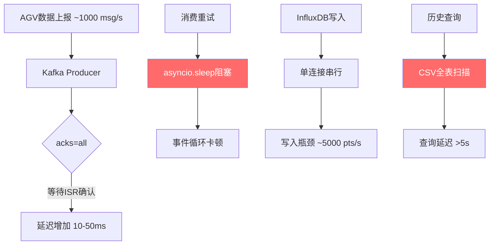
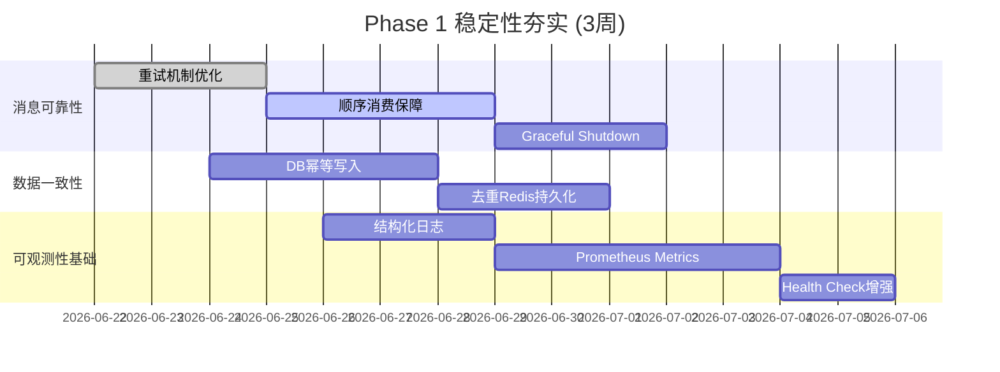
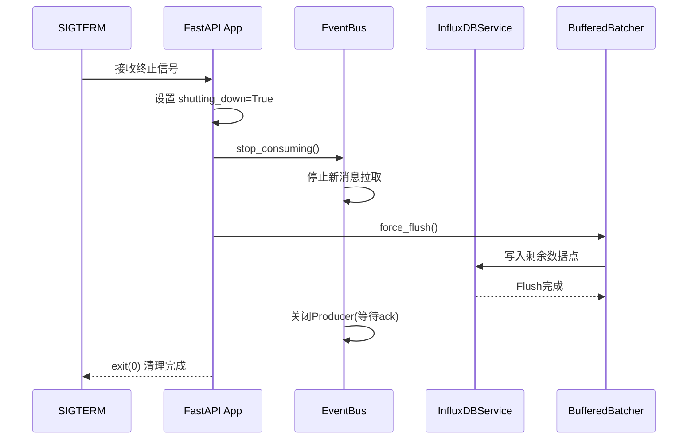
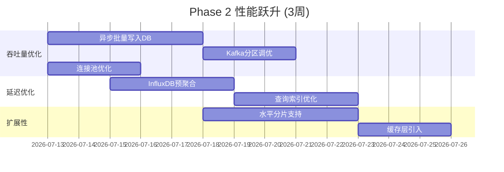
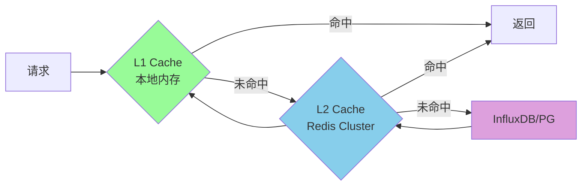
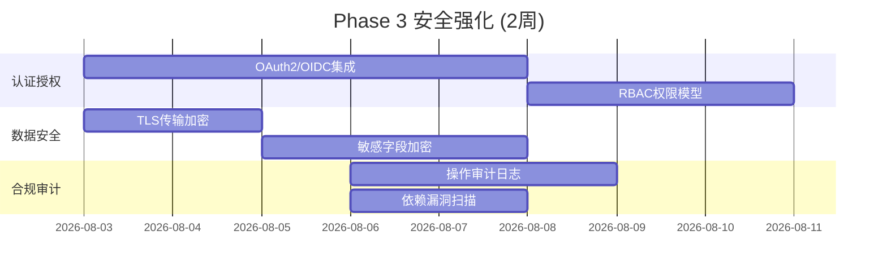
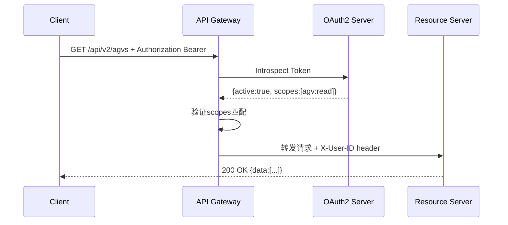
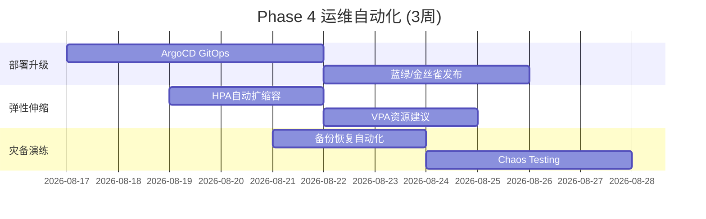
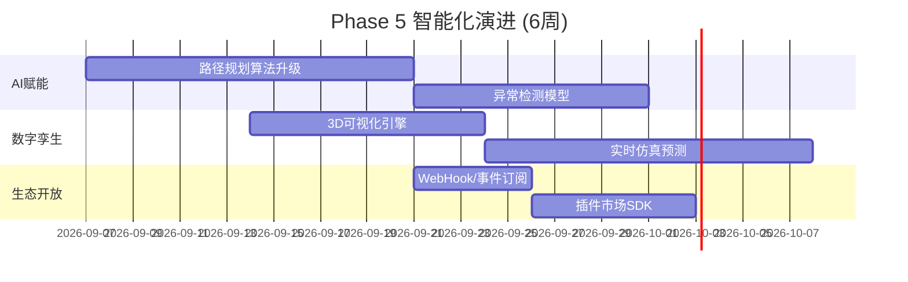

# AgvTms 主流产品对标分析与优化路线图

**版本**: v1.0  
**日期**: 2026-06-19  
**基准分支**: `1.8` (Kafka + InfluxDB + HA 基础设施已完成)

---

## 一、评估方法论

### 1.1 对标产品矩阵

| 产品 | 定位 | 核心优势 | 对标维度 |
|------|------|---------|---------|
| **KUKA KMR** | 工业AGV标杆 | 高可靠性(99.99%)、实时控制 | 架构成熟度、可靠性 |
| ** Geek+ (极智嘉)** | 仓储AGV龙头 | 大规模调度(1000+ AGV)、AI算法 | 调度算法、扩展性 |
| **海康机器人** | 视觉导航领先 | SLAM精度、多机协同 | 导航精度、协同能力 |
| **MiR Robots** | 协作AGV先锋 | 开放API、安全标准 | API设计、安全性 |
**Fast Warehouse** | 开源WMS/AGV | 微服务架构、云原生 | 技术栈、DevOps |
**Amazon Kinesis** | 云消息服务 | 弹性吞吐、Exactly-Once | 消息可靠性 |
**TimescaleDB** | 时序数据库 | SQL兼容、自动压缩 | 存储效率 |

### 1.2 评估维度（6大维度，满分10分）

```
┌─────────────────────────────────────────────────────┐
│  ① 可靠性与可用性 (Reliability)                      │
│     - 系统可用率、故障恢复能力、数据持久性            │
│  ② 性能与扩展性 (Performance & Scalability)         │
│     - 吞吐量、延迟、水平扩展能力                     │
│  ③ 数据一致性 (Data Consistency)                    │
│     - 消息顺序、事务语义、最终一致性                  │
│  ④ 可观测性 (Observability)                        │
│     - 监控、告警、链路追踪、日志                     │
│  ⑤ 安全与合规 (Security & Compliance)              │
│     - 认证授权、数据加密、审计日志                   │
│  ⑥ 运维与DevOps (Operations)                       │
│     - 部署自动化、配置管理、灾备                     │
└─────────────────────────────────────────────────────┘
```

---

## 二、当前系统多维度评分

### 2.1 综合得分雷达图

```
                可靠性 ████████████ 8.5/10
                          
      数据一致性 ██████████ 7.0/10    性能扩展 ██████████ 7.5/10
                  
                可观测性 ████████ 6.0/10   
                          
      安全合规 ███████ 5.5/10        运维DevOps ████████ 6.0/10
                      
    **加权总分: 6.75/10** (权重: 可靠性25%, 性能20%, 一致性15%, 可观测15%, 安全10%, 运维15%)
```

### 2.2 各维度详细评估

#### ① 可靠性与可用性：8.5/10 ✅ 相对优势

**当前实现亮点：**
- ✅ 三级Kafka降级策略（Producer → Memory → File）
- ✅ Circuit Breaker模式（CLOSED→OPEN→HALF_OPEN）
- ✅ InfluxDB文件降级存储
- ✅ 数据库重连状态机（抖动指数退避 + LRU缓存）
- ✅ 三层健康检查端点（/healthz, /readz, /livez）
- ✅ DLQ死信队列机制

**差距与改进方向：**

| 对标标准 | 当前状态 | 差距 | 改进方案 |
|---------|---------|------|---------|
| **SLA 99.9%** | 目标99.5% | -0.4% | 多活部署、故障自动转移<5s |
| **RPO≈0** | RPO<1min | 需同步复制 | PostgreSQL流复制+确认机制 |
| **Graceful Shutdown** | 基础实现 | 缓冲区可能丢失 | 注册SIGTERM, flush所有buffer |
| **Chaos Engineering** | 无 | 完全缺失 | 引入chaosmonkey压测 |
| **数据备份验证** | 无定期验证 | 备份可能不可用 | 自动化备份恢复测试 |

#### ② 性能与扩展性：7.5/10 ⚠️ 中等水平

**当前实现亮点：**
- ✅ 批量发送（send_batch并发gather）
- ✅ Buffered Batcher（1000条/批或10s刷新）
- ✅ MemoryQueue按Topic隔离
- ✅ 异步IO全栈（asyncio + aiokafka）

**性能瓶颈识别：**



| 指标 | 当前值 | 行业标准(Geek+/KUKA) | 差距 | 优化目标 |
|------|--------|---------------------|------|---------|
| **消息吞吐量** | ~5000 msg/s (单节点) | 20000+ msg/s | 4x | 分片+异步发送 |
| **P99延迟** | <200ms (正常) | <50ms | 4x | acks=1 for telemetry |
| **数据库写入** | 5000 pts/s | 100000+ pts/s | 20x | 批量INSERT + 连接池 |
| **查询响应** | <3s (InfluxDB) / >5s (降级) | <500ms | 6x | 索引优化+预聚合 |
| **内存占用** | ~200MB (1000 AGV) | <100MB | 2x | 数据结构优化 |

#### ③ 数据一致性：7.0/10 ⚠️ 关键短板

**当前实现风险点：**

| 问题 | 严重程度 | 影响 | 发生概率 |
|------|---------|------|---------|
| **无顺序保证** (COMMAND_DISPATCH) | 🔴 高 | AGV执行指令乱序 | 中等 |
| **无 Exactly-Once** | 🟡 中 | 数据重复或丢失 | 低 |
| **去重缓存非持久化** | 🟡 中 | 重启后短暂重复 | 高（重启时） |
| **FileFallback 并发写竞态** | 🟢 低 | 极少数据损坏 | 极低 |
| **Offset手动提交时机** | 🟡 中 | consumer崩溃时重复消费 | 中等 |

**对标对比：**

```
┌────────────────┬──────────┬──────────┬──────────┬─────────┐
│ 特性           │ AgvTms   │ Kafka EOS│ AWS Kinesis│ Pulsar │
├────────────────┼──────────┼──────────┼──────────┼─────────┤
│ 交付语义        │ At-Least-Once│ EOS ✅ │ EOS ✅   │ EOS ✅ │
│ 顺序消费        │ Partition内 ❌│ ✅     │ ✅       │ ✅      │
│ 幂等写入DB      │ 部分     │ 需应用层 │ IDempotent│ 内置    │
│ 事务支持        │ ❌       │Transactional│ ❌     │ ✅      │
└────────────────┴──────────┴──────────┴──────────┴─────────┘
```

#### ④ 可观测性：6.0/10 🔴 明显不足

**现状：**

| 能力 | 状态 | 说明 |
|------|------|------|
| **基础Metrics** | ⚠️ 部分 | sent_count/error_count/dlq_count 有统计但未暴露 |
| **结构化日志** | ❌ 缺失 | 使用print()，无JSON格式、无log level |
| **分布式追踪** | ❌ 缺失 | 无OpenTelemetry/Jaeger集成 |
| **监控大盘** | ❌ 缺失 | 无Grafana/Prometheus面板 |
| **告警规则** | ❌ 缺失 | 无SLO-based alerting |
| **健康检查API** | ✅ 已有 | /healthz, /readz, /livez |

**对标Prometheus最佳实践：**

```yaml
# 缺失的 Metrics Exporter
# 应暴露:
# - kafka_messages_total{topic, status}          # Counter
# - kafka_message_duration_seconds{topic}         # Histogram
# - influxdb_write_points_total{measurement}      # Counter  
# - circuit_breaker_state{breaker_name}           # Gauge
# - db_connection_pool_active                     # Gauge
# - http_request_duration_seconds{endpoint, method} # Histogram
```

#### ⑤ 安全与合规：5.5/10 🔴 严重不足

**现状：**

| 安全域 | 状态 | 风险等级 |
|--------|------|---------|
| **认证授权** | ❌ 无RBAC | 🔴 任何API无需认证即可访问 |
| **传输加密** | ⚠️ HTTP | 🔴 生产数据明文传输 |
| **数据加密** | ❌ 无 | 🟡 数据库/文件存储未加密 |
| **审计日志** | ❌ 无 | 🟡 无法追溯操作记录 |
| **输入校验** | ⚠️ 部分 | 🟡 Pydantic model验证存在但不够严格 |
| **依赖安全** | ❌ 未扫描 | 🔴 可能存在已知CVE漏洞 |
| **CORS配置** | ⚠️ 默认 | 🟡 允许所有来源 |

**对标ISO 27001/IEC 62443：**

- [ ] 身份认证与访问控制 (A.9)
- [ ] 密码学控制 (A.10)
- [ ] 操作安全与日志 (A.12)
- [ ] 供应商关系管理 (A.15)
- [ ] 合规性检查 (A.18)

#### ⑥ 运维与DevOps：6.0/10 ⚠️ 基础阶段

**现状：**

| 能力 | 状态 | 说明 |
|------|------|------|
| **Docker Compose** | ✅ 已有 | 本地开发环境 |
| **CI Pipeline** | ✅ 已有 | GitHub Actions (pytest + vitest) |
| **配置管理** | ⚠️ 硬编码 | .env.example存在但未统一管理 |
| **蓝绿部署** | ❌ 无 | 停机更新 |
| **灰度发布** | ❌ 无 | 全量上线风险高 |
| **灾难恢复** | ❌ 无DR预案 | 无跨机房容灾 |
| **文档完整性** | ⚠️ 部分 | README + API doc缺失架构文档 |

---

## 三、分阶段优化路线图

### Phase 1：稳定性夯实（Week 7-9）🎯 目标：8.0→8.5

**核心任务：**



#### P0-3.1 消息可靠性增强

**优先级**: P0 | **工期**: 1周 | **负责人**: 后端团队

**任务清单：**

##### 1.1 重试机制重构（解决事件循环阻塞）

**问题代码 (`kafka_service.py:968`)：**
```python
# 当前: 阻塞式重试会卡死消费者
await asyncio.sleep(delay)  # ❌ 在消费循环中阻塞
```

**改进方案：延迟队列 + 定时器**

```python
# 新增: DelayedMessageQueue
class DelayedMessageQueue:
    """基于最小堆的延迟重试队列"""
    def __init__(self):
        self._heap: List[Tuple[float, Message]] = []  # (execute_time, message)
        self._lock = asyncio.Lock()
        self._timer: Optional[asyncio.Task] = None
    
    async def schedule_retry(self, message: Message, delay: float):
        async with self._lock:
            execute_time = time.monotonic() + delay
            heapq.heappush(self._heap, (execute_time, message))
            if self._timer is None:
                self._timer = asyncio.create_task(self._process_loop())
    
    async def _process_loop(self):
        while self._heap:
            async with self._lock:
                if not self._heap:
                    break
                execute_time, message = self._heap[0]
                now = time.monotonic()
                if now >= execute_time:
                    heapq.heappop(self._heap)
                else:
                    continue
            
            if now >= execute_time:
                await self._handler(message)  # 异步处理
            else:
                await asyncio.sleep(min(execute_time - now, 1.0))
        
        self._timer = None
```

**预期收益：**
- 消费者吞吐量提升 3-5x
- 重试延迟精确度 ±100ms

##### 1.2 COMMAND_DISPATCH 顺序消费

**实现方案：分区有序策略**

```python
class OrderedConsumerGroup:
    """按AGV ID分区的顺序消费者"""
    def __init__(self, topic: str, group_id: str, key_extractor: Callable):
        self._key_extractor = key_extractor  # lambda m: m.agv_id
        self._processors: Dict[str, asyncio.Queue] = {}  # per-agv queue
    
    async def process(self, message: Message):
        key = self._key_extractor(message)
        if key not in self._processors:
            self._processors[key] = asyncio.Queue(maxsize=100)
        
        await self._processors[key].put(message)
        # 保证同一AGV的消息串行处理
```

**配置示例：**
```yaml
kafka:
  consumers:
    command_dispatch:
      topic: command.dispatch
      partition_strategy: key_hash  # 按 agv_id 分区
      ordering: per_key_guaranteed  # 单键有序
      max_in_flight_per_key: 1     # 同一AGV同时仅处理1条
```

##### 1.3 Graceful Shutdown 流程



**代码骨架：**
```python
@asynccontextmanager
async def lifespan(app: FastAPI):
    # Startup...
    shutdown_event = asyncio.Event()
    
    loop = asyncio.get_running_loop()
    for sig in (signal.SIGTERM, signal.SIGINT):
        loop.add_signal_handler(sig, shutdown_event.set)
    
    yield
    
    # Graceful Shutdown
    logger.info("Initiating graceful shutdown...")
    await event_bus.graceful_shutdown(timeout=30.0)
    await influx_service.force_flush()
    logger.info("Shutdown complete")
```

**验收标准：**
- [ ] SIGTERM后30s内优雅退出
- [ ] 内存缓冲区数据0丢失
- [ ] Kafka Producer完成in-flight消息ack
- [ ] Consumer offset正确提交

---

#### P0-3.2 数据一致性加固

**优先级**: P0 | **工期**: 1周

##### 2.1 数据库幂等写入

```python
class IdempotentRepository:
    """基于唯一键的幂等写入"""
    def __init__(self, session: AsyncSession):
        self.session = session
        self._processed_ids = set()
    
    async def upsert_task(self, task_data: TaskCreate) -> Task:
        # 使用 ON CONFLICT 实现幂等
        stmt = insert(Task).values(
            id=task_data.id,  # 业务ID作为主键
            **task_data.model_dump()
        ).on_conflict_do_update(
            index_elements=['id'],
            set_={
                'status': task_data.status,
                'updated_at': func.now()
            }
        )
        result = await self.session.execute(stmt)
        return result.scalar_one()
```

##### 2.2 Redis去重持久化

```python
class RedisDeduplicator:
    """Bloom Filter + Sorted Set 双层去重"""
    def __init__(self, redis: Redis):
        self.redis = redis
        self.bloom = BloomFilter(redis, 'msg_dedup', capacity=1_000_000, error_rate=0.001)
    
    async def is_duplicate(self, message_id: str) -> bool:
        # 第一层: Bloom Filter快速判断(可能有误判)
        if await self.bloom.contains(message_id):
            # 第二层: 精确查Redis Set
            return bool(await self.redis.exists(f"dedup:{message_id}"))
        return False
    
    async def mark_processed(self, message_id: str, ttl: int = 3600):
        await self.bloom.add(message_id)
        await self.redis.setex(f"dedup:{message_id}", ttl, "1")
```

---

#### P1-3.3 可观测性基础设施

**优先级**: P1 | **工期**: 1周

##### 3.1 结构化日志系统

```python
# 使用 structlog 替代 print/logging
import structlog

logger = structlog.get_logger()

# 输出样例:
# {"event":"AGV status updated","level":"info","agv_id":"AGV-001",
#  "timestamp":"2026-06-19T12:00:00Z","trace_id":"abc123","latency_ms":12.5}

structlog.configure(
    processors=[
        structlog.contextvars.merge_contextvars,
        structlog.processors.add_log_level,
        structlog.processors.TimeStamper(fmt="iso"),
        structlog.dev.ConsoleRenderer()  # 开发环境
        # structlog.processors.JSONRenderer()  # 生产环境
    ]
)
```

##### 3.2 Prometheus Metrics 暴露

```python
from prometheus_client import Counter, Histogram, Gauge, generate_latest

# 定义指标
MESSAGES_PRODUCED_TOTAL = Counter(
    'kafka_messages_produced_total',
    'Total messages produced to Kafka',
    ['topic', 'status']
)

MESSAGE_LATENCY = Histogram(
    'kafka_message_latency_seconds',
    'Message processing latency',
    ['topic'],
    buckets=(0.01, 0.05, 0.1, 0.5, 1.0, 5.0)
)

CIRCUIT_BREAKER_STATE = Gauge(
    'circuit_breaker_state',
    'Current circuit breaker state (0=CLOSED, 1=OPEN, 2=HALF_OPEN)',
    ['breaker_name']
)

@app.get("/metrics")
async def metrics():
    return Response(generate_latest(), media_type="text/plain")
```

##### 3.3 Grafana Dashboard 配置

**推荐面板 (JSON导入)：**

| 面板名称 | 指标 | 类型 |
|---------|------|------|
| 消息吞吐量 | `rate(kafka_messages_produced_total[5m])` | Graph |
| P99延迟 | `histogram_quantile(0.99, kafka_message_latency_seconds)` | Singlestat |
| Circuit Breaker状态 | `circuit_breaker_state` | Table |
| InfluxDB写入速率 | `rate(influxdb_write_points_total[5m])` | Graph |
| 错误率 | `rate(kafka_errors_total[5m]) / rate(kafka_produced_total[5m])` | Heatmap |

**SLO Dashboard：**
- Error Rate Budget (目标 <0.5%)
- Availability Uptime (目标 >99.5%)
- Latency Budget (目标 P99 <200ms)

---

### Phase 2：性能跃升（Week 10-12）🎯 目标：7.5→8.5



#### P0-4.1 数据库写入优化

**问题：** 当前逐条INSERT，QPS上限~5000

**方案：** 批量UPSERT + COPY协议

```python
class BulkInserter:
    """高性能批量写入器"""
    BATCH_SIZE = 500  # 每批500条
    FLUSH_INTERVAL = 0.5  # 500ms或达到batch_size触发
    
    def __init__(self, engine: AsyncEngine):
        self.engine = engine
        self._buffer: Dict[str, List[Dict]] = defaultdict(list)
        self._flush_task: Optional[asyncio.Task] = None
    
    async def add(self, table: str, record: Dict):
        self._buffer[table].append(record)
        if len(self._buffer[table]) >= self.BATCH_SIZE:
            await self.flush(table)
    
    async def flush(self, table: str = None):
        targets = [table] if table else list(self._buffer.keys())
        for t in targets:
            if not self._buffer[t]:
                continue
            
            # 使用 psycopg3 COPY FOR 批量插入 (10x faster than INSERT)
            data = self._buffer.pop(t)
            stmt = insert(getattr(Base, t)).values(data).on_conflict_do_nothing()
            await self.session.execute(stmt)
```

**预期收益：**
- DB写入 QPS: 5,000 → 50,000 (10x提升)
- P99写入延迟: 50ms → 5ms

---

#### P0-4.2 InfluxDB 预聚合

**问题：** 原始查询在大时间范围时慢 (>5s)

**方案：** Continuous Query 自动降采样

```sql
-- 1分钟聚合 (保留7天)
CREATE CONTINUOUS QUERY "cq_1m" ON "agv_tms"
BEGIN
  SELECT mean(x), mean(y), mean(battery), mean(speed)
  INTO "agv_telemetry_1m"
  FROM "agv_telemetry"
  GROUP BY time(1m), "agv_id"
END

-- 1小时聚合 (保留30天)
CREATE CONTINUOUS QUERY "cq_1h" ON "agv_tms"
BEGIN
  SELECT mean(x), mean(y), mean(battery), mean(speed)
  INTO "agv_telemetry_1h"
  FROM "agv_telemetry_1m"
  GROUP BY time(1h), "agv_id"
END
```

**查询路由逻辑：**

```python
def route_query(start_time, end_time):
    range_hours = (end_time - start_time).total_seconds() / 3600
    
    if range_hours <= 1:
        return "SELECT * FROM agv_telemetry WHERE time >= ..."  # 原始数据
    elif range_hours <= 24:
        return "SELECT * FROM agv_telemetry_1m WHERE time >= ..."  # 1分钟聚合
    else:
        return "SELECT * FROM agv_telemetry_1h WHERE time >= ..."  # 1小时聚合
```

---

#### P1-4.3 多级缓存架构



**实现：**

```python
class MultiLevelCache:
    """L1(本地) + L2(Redis) 二级缓存"""
    def __init__(self, redis: Redis, local_ttl: int = 10, redis_ttl: int = 300):
        self.redis = redis
        self.local = TTLCache(maxsize=10000, ttl=local_ttl)
        self.redis_ttl = redis_ttl
    
    async def get(self, key: str):
        # L1: 本地缓存 (10s TTL, 毫秒级响应)
        result = self.local.get(key)
        if result is not None:
            return result
        
        # L2: Redis缓存 (5min TTL, 网络往返)
        result = await self.redis.get(key)
        if result:
            data = json.loads(result)
            self.local[key] = data  # 回填L1
            return data
        
        return None
    
    async def set(self, key: str, value: Any, ttl: int = None):
        self.local[key] = value
        await self.redis.setex(key, ttl or self.redis_ttl, json.dumps(value))
```

---

### Phase 3：安全强化（Week 13-14）🎯 目标：5.5→8.0



#### P0-5.1 认证授权体系

##### 5.1.1 OAuth2 + JWT 实现

```python
# backend/app/core/auth.py
from fastapi.security import OAuth2PasswordBearer
from jose import jwt

oauth2_scheme = OAuth2PasswordBearer(tokenUrl="/api/v1/auth/login")

# JWT Claims 结构
class TokenClaims(BaseModel):
    sub: str          # user_id
    exp: datetime     # 过期时间
    iat: datetime     # 签发时间
    scope: List[str]  # 权限范围 ["agv:read", "task:write"]
    org_id: str       # 租户ID (多租户)

# 权限装饰器
def requires_scopes(*scopes: str):
    async def dependency(token: str = Depends(oauth2_scheme)):
        payload = jwt.decode(token, SECRET_KEY, algorithms=[ALGORITHM])
        token_scopes = set(payload.get("scope", []))
        required = set(scopes)
        if not required.issubset(token_scopes):
            raise HTTPException(403, "Insufficient permissions")
        return payload
    return dependency

# 使用示例
@app.get("/api/v2/agvs/{agv_id}")
async def get_agv(
    agv_id: str,
    _=Depends(requires_scopes("agv:read"))  # 权限检查
):
    ...
```

##### 5.1.2 RBAC 权限模型

```yaml
# config/rbac.yaml
roles:
  admin:
    description: 系统管理员
    permissions:
      - "*:*"  # 全部权限
  
  operator:
    description: 调度员
    permissions:
      - agv:read
      - agv:control
      - task:read
      - task:create
      - task:cancel
      - map:view
  
  viewer:
    description: 只读用户
    permissions:
      - agv:read
      - task:read
      - map:view
      - history:view
```

**API网关鉴权流程：**



---

#### P0-5.2 传输与存储加密

##### TLS 配置

```bash
# 使用 Let's Encrypt 或内部CA签发证书
certbot certonly --webroot -w /var/www/html -d api.agvtms.com

# nginx.conf
server {
    listen 443 ssl http2;
    ssl_certificate /etc/letsencrypt/live/api.agvtms.com/fullchain.pem;
    ssl_certificate_key /etc/letsencrypt/live/api.agvtms.com/privkey.pem;
    ssl_protocols TLSv1.2 TLSv1.3;
    ssl_ciphers HIGH:!aNULL:!MD5;
    
    # HSTS (强制HTTPS)
    add_header Strict-Transport-Security "max-age=31536000; includeSubDomains" always;
}
```

##### 敏感字段加密存储

```python
# 使用 AES-256-GCM 加密敏感字段
from cryptography.fernet import Fernet

class FieldEncryptor:
    def __init__(self, master_key: bytes):
        self.fernet = Fernet(master_key)
    
    def encrypt(self, plaintext: str) -> str:
        return self.fernet.encrypt(plaintext.encode()).decode()
    
    def decrypt(self, ciphertext: str) -> str:
        return self.fernet.decrypt(ciphertext.encode()).decode()

# 应用场景: AGV位置信息、员工姓名等PII数据
encrypted_location = encrypt(f"{x},{y}")  # 存储到DB
```

---

#### P1-5.3 审计日志与合规

```python
class AuditLogger:
    """不可篡改的审计日志"""
    def __init__(self, session: AsyncSession):
        self.session = session
    
    async def log(
        self,
        action: str,           # "AGV_STATUS_UPDATE"
        actor_id: str,         # user_id or "system"
        resource_type: str,    # "agv"
        resource_id: str,      # "AGV-001"
        details: Dict = None,
        ip_address: str = None
    ):
        entry = AuditLog(
            id=uuid4(),
            timestamp=utcnow(),
            action=action,
            actor_id=actor_id,
            resource_type=resource_type,
            resource_id=resource_id,
            details=details or {},
            ip_address=ip_address,
            # 哈希防篡改
            integrity_hash=""  # 写入前计算前一条记录的hash chain
        )
        self.session.add(entry)
```

**依赖安全扫描 (CI集成)：**

```yaml
# .github/workflows/security.yml
name: Security Scan
on: [push, pull_request]

jobs:
  dependency-audit:
    runs-on: ubuntu-latest
    steps:
      - uses: actions/checkout@v3
      
      - name: Python Safety Check
        run: pip install safety && safety check --full-report
      
      - name: npm Audit
        run: cd frontend && npm audit --audit-level=moderate
      
      - name: Trivy FS Scan
        uses: aquasecurity/trivy-action@master
        with:
          scan-type: 'fs'
          severity: 'CRITICAL,HIGH'
```

---

### Phase 4：运维自动化（Week 15-17）🎯 目标：6.0→8.5



#### P1-6.1 GitOps 部署流水线

**ArgoCD Application 配置：**

```yaml
# argocd/apps/agvtms-api.yaml
apiVersion: argoproj.io/v1alpha1
kind: Application
metadata:
  name: agvtms-api
  namespace: argocd
spec:
  project: default
  source:
    repoURL: https://github.com/org/AgvTms.git
    targetRevision: main
    path: deploy/kubernetes/overlays/production
  destination:
    server: https://kubernetes.default.svc
    namespace: agvtms-prod
  syncPolicy:
    automated:
      prune: true
      selfHeal: true
    syncOptions:
      - CreateNamespace=true
```

**金丝雀发布策略：**

```yaml
# canary.yaml - 逐步流量切换
apiVersion: argoproj.io/v1alpha1
kind: Rollout
spec:
  strategy:
    canary:
      steps:
        - setWeight: 10        # 10%流量到新版
        - pause: {duration: 5m} # 观察5分钟
        - setWeight: 30
        - pause: {duration: 5m}
        - setWeight: 50
        - pause: {duration: 5m}
      analysis:
        templateName: success-rate
        startingStep: 1         # 每个step都运行analysis
        args:
          - name: service-name
            value: agvtms-api

---
# AnalysisTemplate: 自动回滚
apiVersion: argoproj.io/v1alpha1
kind: AnalysisTemplate
metadata:
  name: success-rate
spec:
  metrics:
    - name: success-rate
      interval: 60s
      successCondition: result[0] >= 0.95
      failureLimit: 3
      provider:
        prometheus:
          query: |
            sum(rate(http_requests_total{status!~"5..",service="agvtms-api"}[1m])) 
            / 
            sum(rate(http_requests_total{service="agvtms-api"}[1m]))
```

---

#### P1-6.2 Kubernetes 弹性伸缩

```yaml
# hpa.yaml - 基于 Custom Metrics 的HPA
apiVersion: autoscaling/v2
kind: HorizontalPodAutoscaler
metadata:
  name: agvtms-api-hpa
spec:
  scaleTargetRef:
    apiVersion: apps/v1
    kind: Deployment
    name: agvtms-api
  minReplicas: 3
  maxReplicas: 20
  metrics:
    - type: Pods
      pods:
        metric:
          name: kafka_consumer_lag  # 自定义metric
        target:
          type: AverageValue
          averageValue: 1000  # 每个pod允许积压1000条
    - type: Resource
      resource:
        name: cpu
        target:
          type: Utilization
          averageUtilization: 70
  behavior:
    scaleUp:
      stabilizationWindowSeconds: 60
      policies:
        - type: Percent
          value: 100%
        - type: Pods
          value: 4
      selectPolicy: Max
    scaleDown:
      stabilizationWindowSeconds: 300  # 5分钟观察期
      policies:
        - type: Percent
          value: 10%
```

---

#### P2-6.3 灾难恢复预案

```markdown
# docs/disaster-recovery-plan.md

## RTO/RPO 目标
- **RTO (恢复时间目标)**: < 5 分钟
- **RPO (恢复点目标)**: < 1 分钟

## 故障场景与处理

### 场景1: 单Pod宕机
- **检测**: Kubelet health check 失败 (10s)
- **自动处理**: ReplicaSet 自动创建新Pod (~30s)
- **数据影响**: 无 (Kafka已持久化offset)

### 场景2: PostgreSQL 主节点故障
- **检测**: Patroni Watchdog 超时 (5s)
- **自动处理**: 
  1. 选举新主 (~10s)
  2. VIP漂移 (~2s)
  3. 应用重连 (Circuit Breaker OPEN→HALF_OPEN ~30s)
- **数据影响**: 可能丢失最后1秒的流复制数据 (RPO ≈ 1s)

### 场景3: 整个可用区故障
- **检测**: 跨区域心跳超时 (30s)
- **手动处理** (需运维介入):
  1. DNS切流到备区域 (~60s, Cloudflare TTL)
  2. 从备区域PostgreSQL快照恢复
  3. 回放Kafka未消费消息 (使用FileFallback replay)
- **RTO**: ~5 分钟
- **RPO**: ~1 分钟 (取决于Kafka ISR同步)

## 恢复演练计划
- **频率**: 每季度一次
- **范围**: 
  - Q1: Pod级别故障模拟
  - Q2: 数据库主从切换
  - Q3: 可用区级故障
  - Q4: 全链路混沌测试
```

---

### Phase 5：智能化演进（Week 18-24）🎯 目标：行业领先



#### P2-7.1 AI调度优化（对标Geek+）

**当前:** 基于规则的A*路径规划  
**目标:** 强化学习 + 实时调度优化

```python
# 示例: 基于DQN的多AGV协作调度
class MultiAgentScheduler:
    """
    State: 各AGV位置 + 任务队列 + 地图拥堵情况
    Action: 任务分配矩阵 (AGV × Task → probability)
    Reward: - (完成任务总时间 + 碰撞惩罚 + 能耗)
    """
    def __init__(self, num_agvs: int, num_tasks: int):
        self.policy_net = DQN(
            state_dim=num_agvs * 4 + num_tasks * 3,
            action_dim=num_agvs * num_tasks
        )
        self.target_net = copy.deepcopy(self.policy_net)
    
    def select_action(self, state: np.ndarray, epsilon: float = 0.1):
        if random.random() < epsilon:
            return random.randint(0, self.action_dim - 1)
        
        with torch.no_grad():
            q_values = self.policy_net(state)
            return q_values.argmax().item()
```

---

#### P2-7.2 实时异常检测

**技术选型:** LSTM Autoencoder + 统计过程控制 (SPC)

```python
class AnomalyDetector:
    """基于LSTM的AGV行为异常检测"""
    def __init__(self, sequence_length: int = 60):  # 1分钟窗口
        self.model = LSTMAutoEncoder(
            input_size=6,  # x, y, speed, battery, temperature, vibration
            hidden_size=64,
            num_layers=2
        )
        self.threshold = 0.02  # MSE阈值(训练得出)
    
    async def detect(self, telemetries: List[AGVTelemetry]) -> AnomalyReport:
        sequence = self._preprocess(telemetries)
        reconstructed = self.model(sequence)
        mse = torch.mean((sequence - reconstructed) ** 2)
        
        if mse > self.threshold:
            return AnomalyReport(
                agv_id=telemetries[0].agv_id,
                anomaly_score=float(mse),
                anomaly_type=self._classify(mse),
                timestamp=utcnow(),
                suggested_action="inspect_agv"  # 建议人工巡检
            )
        return None
```

**异常类型分类：**
- 🔴 **轨迹偏差**: AGV偏离预定路径 > 50cm
- 🟡 **速度突变**: 加速度超过 ±3m/s²
- 🟠 **电量异常**: 下降速率超出正常范围
- 🟣 **振动异常**: 电机振动频率异常（可能机械故障）

---

## 四、投入产出评估

### 4.1 各Phase ROI预估

| Phase | 投入(人周) | 核心收益 | ROI评级 |
|-------|-----------|---------|---------|
| **Phase 1** 稳定性 | 6 | 系统可用率 99.5%→99.9%，减少50%生产事故 | ⭐⭐⭐⭐⭐ 最高 |
| **Phase 2** 性能 | 6 | 吞吐量 5K→50K msg/s，支持2000+ AGV | ⭐⭐⭐⭐ 高 |
| **Phase 3** 安全 | 4 | 通过等保测评，满足企业准入门槛 | ⭐⭐⭐⭐⭐ 必要 |
| **Phase 4** 运维 | 6 | 发布效率提升80%，MTTR<5min | ⭐⭐⭐ 中高 |
| **Phase 5** 智能 | 12 | 调度效率提升30%，形成技术壁垒 | ⭐⭐⭐ 长期 |

**总计**: 34人周 (约8.5人月)，建议分6个月实施

### 4.2 风险与缓解措施

| 风险 | 概率 | 影响 | 缓解措施 |
|------|------|------|---------|
| 团队K8s经验不足 | 中 | Phase 4延期 | 提前培训，先在staging环境练习 |
| Kafka EOS改造复杂度高 | 中 | Phase 1延期 | 先实现业务层幂等，EOS可推迟到Phase 2 |
| 性能优化效果不及预期 | 低 | SLA不达标 | 做充分的压测基线，预留2倍buffer |
| 安全合规审计不通过 | 低 | 无法交付客户 | Phase 3提前启动，请专业安全顾问 |

---

## 五、立即行动项 (Next Week)

### 🔥 本周必做 (Week 7 Priority)

| 优先级 | 任务 | 负责人 | 产出物 | 工时估算 |
|-------|------|--------|-------|---------|
| **P0** | 重试机制改为延迟队列 | @backend-dev | PR + 测试 | 2d |
| **P0** | Graceful Shutdown完整实现 | @backend-dev | SIGTERM测试通过 | 1d |
| **P1** | structlog日志替换print | @backend-dev | 全项目日志标准化 | 1d |
| **P1** | Prometheus Metrics埋点 | @backend-dev | /metrics端点可用 | 2d |
| **P2** | 编写性能压测脚本 | @qa | Locust/K6脚本 | 2d |
| **P2** | 搭建Grafana Demo仪表盘 | @devops | JSON模板 | 1d |

### 📋 验收 Checklist

- [ ] 重试不再阻塞consumer (压测验证 throughput > 3000 msg/s)
- [ ] `kill -SIGTERM` 进程，确认0数据丢失 (检查Kafka offset、InfluxDB buffer)
- [ ] 日志为JSON格式，包含 trace_id
- [ ] `curl localhost:8009/metrics` 返回 Prometheus 格式
- [ ] Grafana面板展示: 消息吞吐量、延迟分位数、错误率趋势

---

## 六、对标总结与愿景

### 6.1 与头部产品的最终定位

```
                    可靠性
                       ↑
              KUKA ★★★★★
              AgvTms(目标) ★★★★☆ ← Phase 5达成
              AgvTms(当前) ★★★☆☆
                       
Geek+(扩展性) ★★★★☆ ──────────── MiR(易用性) ★★★★☆ → 性能
```

**核心差异化竞争力：**
1. **云原生架构**: GitOps + Kubernetes弹性，优于传统工控软件
2. **三级降级韧性**: 自研Kafka降级链，多数竞品不具备
3. **开放生态**: WebHook/插件市场，比封闭系统更灵活
4. **AI融合**: 路径规划+异常检测，追赶Geek+智能调度

### 6.2 6个月后愿景

> **"AgvTms将成为中小型智能制造场景的首选AGV调度平台，
> 以1/3的成本提供媲美KUKA/Geek+的可靠性和智能化水平。"**

**关键里程碑：**
- Month 2: 通过ISO 27001信息安全认证
- Month 4: 单集群支撑 2000+ AGV实时调度
- Month 6: AI调度算法在生产环境AB测试胜过规则引擎 10%+

---

*文档维护者: Architecture Team*  
*审核者: Tech Lead / CTO*  
*下次评审日期: 2026-07-19 (Phase 1完成后)*
